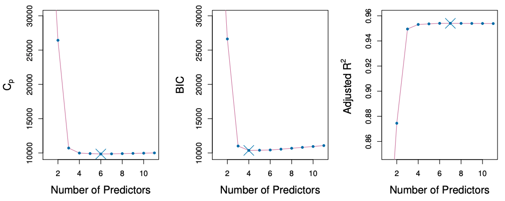

    

<!-- _theme: reveal -->
  

# Regularization

# 金融投资学

## Instructor: Haoran LEI

## Hunan University

---

# Beyond linear models

- Ch6: discuss some ways in which the
linear model can be improved, by **replacing OLS with some alternative fitting procedures**

- Ch7: generalize the linear
model in order to accommodate *non-linear*, but still
*additive*, relationships.

- Ch8: more general *non-linear* models.

---

# Why consider alternatives to least squares?

- **Prediction Accuracy:** 
especially when $p > n$, to control the
variance.

- **Model Interpretability:**
By removing irrelevant features —
that is, by setting the corresponding coefficient estimates
to zero — we can obtain a model that is more easily
interpreted. 
   - *automatical feature selection*

---

# Three classes of methods

1. **Subset Selection.**
First, identify a subset of the predictors
that are related to the response, then fit a model using LS.

1. **Shrinkage.**
Fit a model involving *all p predictors*, but
the estimated coefficients are *shrunken towards zero*
relative to the least squares estimates. 
   - This **shrinkage** (also
     known as **regularization**) has the effect of reducing variance
     and can also perform variable selection.
   - Recall *variance-bias  tradeoff*

---

3. **Dimension Reduction.** 

   - Project the $p$ predictors into a
     $M$-dimensional subspace, where $M < p$. 
     This is achieved by
     computing $M$ different linear combinations, or projections,
     of the variables. 
   - Then these $M$ projections are used as
     predictors to fit a linear regression model by least squares.

The third method (**Dimension Reduction**) is related to the first one (**Subset Selection**).

---

# 1. Subset Selection

**Step 1.** For $k=1,2,..., p$:
   1. Fit all $\binom{p}{k}$ models that contain exactly $k$ predictors.
   2. Pick the "best" (i.e., having the smallest RSS/MSE) among these $\binom{p}{k}$ models.

**Step 2.** Select a single "best" model from the $p$ candidates, using:
   - adjusted $R^2$, $C_p$ (AIC), BIC,  cross-validated prediction error, ...

---

# $C_p$, AIC, BIC, and Adjusted $R^2$

- These techniques adjust the training error for the model
size, and can be used to select among a set of models with
different numbers of variables.

- The next figure displays $C_p$, AIC, BIC, and Adjusted $R^2$ for the
best model of each size produced by best subset selection
on the **Credit data set**.

---

   
Credit data example

---

# Details of these criterion: $C_p$ and AIC

- Mallow’s $C_p$ defined as below,
where $d$ is the total # of parameters used and
$\hat\sigma$ is 
an estimate of the variance of $\epsilon$.
$$
C_p = \frac 1n (\text{RSS} + 2d \hat\sigma^2),
$$

-  The **AIC criterion** is defined for a large class of models fit by maximum likelihood:
$$
AIC = −2 \log L + 2  d
$$
- where $L$ is the maximized value of the likelihood function.

---

# Details of these criterion: $C_p$ and AIC

- In the case of the **linear model with Gaussian errors**,
maximum likelihood and least squares are the same thing,
and $C_p$ and AIC are *equivalent.*

---

# Details of these criterion: BIC

